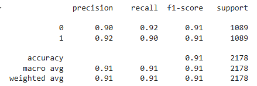
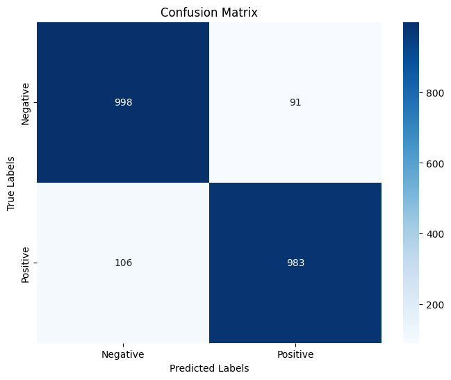
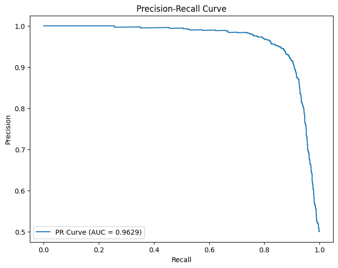
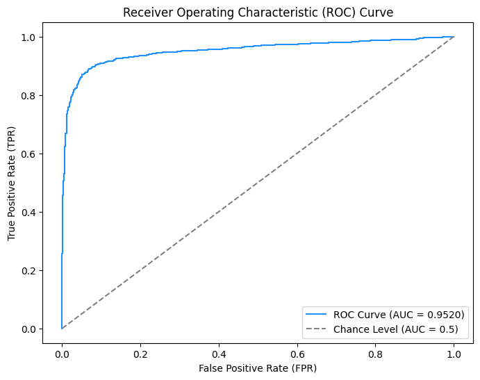

# Detecting_Palm_Oil_Plantations_Neural_Networks

## The original dataset can be found here: https://www.kaggle.com/c/widsdatathon2019/data
Despite the ubiquitousness and versatility of palm oil, palm oil plantations have contributed to massive deforestation, especially within highly biodiverse forests. The goal of this project is to develop a model that can detect palm oil plantations from satellite images. This model can be used to assist with monitoring deforestation and allow government agencies to enforce environmental policies, thereby preventing further deforestation and biodversity loss.

## Results
- Utilizing the pre-trained VGG19 deep convolutional neural network, we achieved an F1-score of 0.91, a ROC-AUC score of 0.952 and Average Precision (AP) score of 0.9629 on the holdout dataset.
  

## Data Notes
- Exploratory data analysis, preprocessing, and wrangling was done in the 'WiDS_Project_preparation.ipynb' notebook
- The folder containing the training images, 'train_images.zip', contains a corresponding annotations file, 'traininglabels.csv', which contained three features:
  - image_id, the filename of the image
  - has_oilpalm, a label where 0 indicates no presence of a palm oil plantation, 1 indicates otherwise
  - score, a confidence score ranging from 0 to 1 indicating the likelihood of the label holding true
- The filenames in the annotations contained '2017' and '2018' at the end, so they were removed
  - Removing these subsequently caused duplicates, so these were removed as well
- Additional images were added over the years after the competition ended but were not officially documented, thereby causing mismatch between the filenames listed in the annotations and the ones in the train images folder
  - The filenames in the annotations were filtered to take this into account
- For the negative-class images, a score of 1 was used
- For the positive-class images, a score of 0.5 and/or greater was used
- After handling improper filenames, about 94% of the training images were negative-class, the other 6% being positive-class
  - Due to significant imbalance, undersampling of the negative-class and oversampling of the positive-class via augmentation were used

## Model Notes
- The model used the pre-trained VGG19 deep convolutional neural network with a custom head
- Optimizer was Adam
- Various transformations were used to augment the positive-class images
- Train and validation was done through 80/20 stratified split
- Dropouts, L2 regularization, He normal initialization, and a lower learning rate were used to prevent overfitting
- A grid search was done on various L2 regularization values and the number of epochs, specifically:
  - For L2 regularization, 0.035, 0.036, 0.037, 0.038, 0.039, and 0.04
  - For the number of epochs, 3 and 4
  - The average F1 score of negative and positive classes was used to update the best model
- Model was trained on Google Colab's L4 GPU
  
## Future Notes
- Try a different pre-trained model
- Try unfreezing and doing another grid search but with learning rate and number of epochs
- Adjusting the augmentation for the positive-class images, maybe reducing one or two different types of transformations
